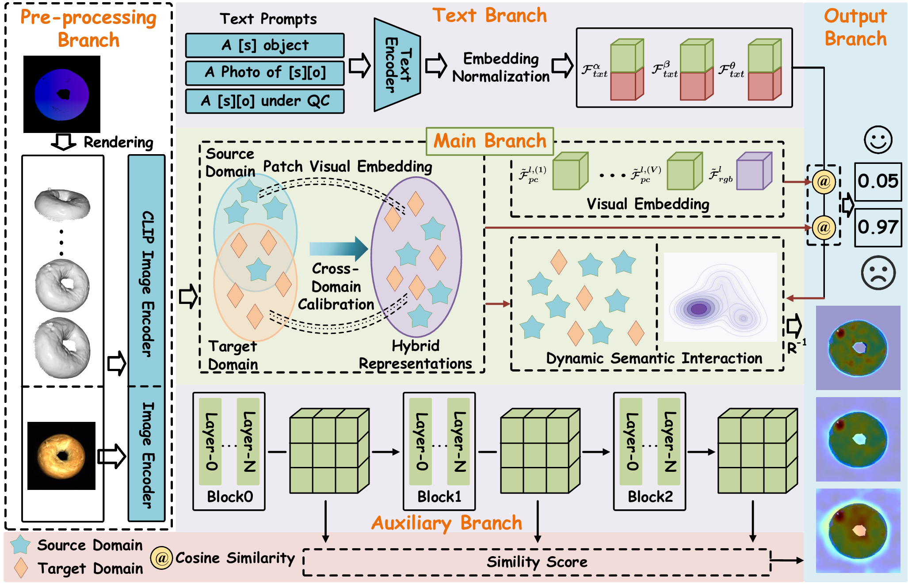

# ZUMA sees the unseen — across modalities, without supervision.
> [**TPAMI 2026**] [**ZUMA: Training-free Zero-shot Unified Multimodal Anomaly Detection**](https://ieeexplore.ieee.org/document/11367454)
>
> Authors: Yunfeng Ma, Min Liu, Shuai Jiang, Jingyu Zhou, Yuan Bian, Xueping Wang, Yaonan Wang.


## Abstract 
Multimodal anomaly detection (MAD) aims to exploit both texture and spatial attributes to identify deviations from normal patterns in complex scenarios. However, zero-shot (ZS) settings arising from privacy concerns or confidentiality constraints present significant challenges to existing MAD methods. To address this issue, we introduce ZUMA, a training-free, Zero-shot Unified Multimodal Anomaly detection framework that unleashes CLIP's cross-modal potential to perform ZS MAD. To mitigate the domain gap between CLIP's pretraining space and point clouds, we propose cross-domain calibration (CDC), which efficiently bridges the manifold misalignment through source-domain semantic transfer and establishes a hybrid semantic space, enabling a joint embedding of 2D and 3D representations. Subsequently, ZUMA performs dynamic semantic interaction (DSI) to enable structural decoupling of anomaly regions in the high-dimensional embedding space constructed by CDC, where natural languages serve as semantic anchors to help DSI establish discriminative hyperplanes within hybrid modality representations. Within this framework, ZUMA enables plug-and-play detection of 2D, 3D or multimodal anomalies, without training or fine-tuning even for cross-dataset or incomplete-modality scenarios. Additionally, to further investigate the potential of the training-free ZUMA within the training-based paradigm, we develop ZUMA-FT, a fine-tuned variant that achieves notable improvements with minimal parameter trade-off. Extensive experiments are conducted on two MAD benchmarks, MVTec 3D-AD and Eyecandies. Notably, the training-free ZUMA achieves state-of-the-art (SOTA) performance on both datasets, outperforming existing ZS MAD methods, including training-based approaches. Moreover, ZUMA-FT further extends the performance boundary of ZUMA with only 6.75 M learnable parameters.
## Framework
 

## How to Run

### Prepare your dataset
We recommend generating the dataset using the scripts. The raw data can be obtained from the [**MVTec 3D-AD**](https://www.mvtec.com/company/research/datasets/mvtec-3d-ad
) and the [**Eyecandies**](https://eyecan-ai.github.io/eyecandies/).

For simplicity, you may also follow the dataset construction procedure used in [**PointAD**](https://github.com/zqhang/PointAD). Note that this may lead to slight differences in the final results compared to ZUMA (e.g., marginally higher or lower performance).

If you encounter any issues during dataset preparation, please feel free to contact us.


### Run ZUMA
Run ZUMA directly with the following command:
```
python train.py --config /path/to/config --test_dataset dataset_name --test_data_path /path/to/dataset
```


## Citation

If you find this paper and repository useful, please cite our paper.

```
@article{ma2026zuma,
  title={ZUMA: Training-free Zero-shot Unified Multimodal Anomaly Detection},
  author={Ma, Yunfeng and Liu, Min and Jiang, Shuai and Zhou, Jingyu and Bian, Yuan and Wang, Xueping and Wang, Yaonan},
  journal={IEEE Transactions on Pattern Analysis and Machine Intelligence},
  year={2026},
  publisher={IEEE}
}
```

## Thanks
Our framework is built upon [**PointAD**](https://github.com/zqhang/PointAD) and [**AnomalyCLIP**](https://github.com/zqhang/AnomalyCLIP). We gratefully acknowledge their authors for their outstanding contributions.
